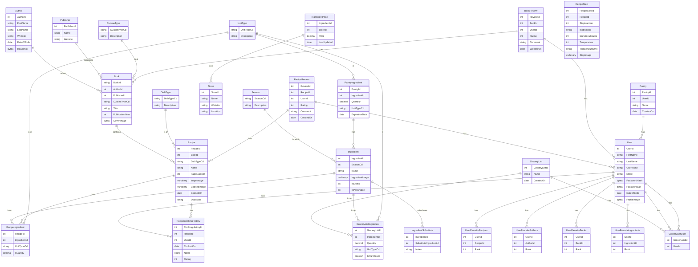

```mermaid
erDiagram  
Author ||--o{ Book : "writes"
Publisher ||--o{ Book : "publishes"
Book ||--o{ Recipe : "contains"
DishType ||--o{ Recipe : "is of"
Season ||--o{ Ingredient : "is within"
CuisineType ||--o{ Book : "is of"
Ingredient ||--o{ IngredientSubstitute : "substitutes"
Ingredient ||--o{ RecipeIngredient : "is on"
Recipe ||--o{ RecipeIngredient : "has"
UnitType ||--o{ RecipeIngredient : "is in"
IngredientPrice ||--o{ Store : "is in" 
User ||--o{ UserFavoriteRecipes : "has"
User ||--o{ UserFavoriteAuthors : "has"
User ||--o{ UserFavoriteBooks : "has"
User ||--o{ UserFavoriteIngredients : "has"
GroceryList ||--o{ GroceryListIngredient : "is on"
Ingredient ||--o{ GroceryListIngredient : "is on"
UnitType ||--o{ GroceryListIngredient : "is"
GroceryList ||--o{ GroceryListUser : "has"
User ||--o{ GroceryListUser : "has"
User ||--o{ GroceryListUser : "has"
RecipeReview ||--o{ Recipe : "has"
RecipeReview ||--o{ User : "has"
BookReview ||--o{ Book : "has"
BookReview ||--o{ User : "has"
Pantry ||--o{ User : "has"
PantryIngredient ||--o{ Ingredient : "has"
UnitType ||--o{ PantryIngredient : "is"
User ||--o{ RecipeCookingHistory : "has"
Recipe ||--o{ RecipeCookingHistory : "has"


%% Reference Tables %%
CuisineType {
	string CuisineTypeCd
	string Description
}
DishType {
	string DishTypeCd
	string Description
}
Season {
	string SeasonCd
	string Description
}
UnitType {
	string UnitTypeCd
	string Description
}

%% Main Tables %%
Author {  
	int AuthorId
	string FirstName  
	string LastName  
	string Website 
	date DateOfBirth
	bytea Headshot
}  
Publisher {
	int PublisherId
	string Name
	string Website
}
Book {  
	string BookId  
	int AuthorId
	int PublisherId
	string CuisineTypeCd
	string Title  
	int PublicationYear  
	bytea CoverImage
}
%% Needs 'CookedOn' to be stored in another table? For multiple times cooked %%
Recipe {
	int RecipeId
	int BookId
	string DishTypeCd
	string Name
	int PageNumber
	varbinary InspoImage
	varbinary CookedImage
	date CookedOn
	string Occasion
}
RecipeStep {
	int RecipeStepId
	int RecipeId
	int StepNumber
	string Instruction
	int DurationMinutes 
	int Temperature
	string TemperatureUnit
	varbinary StepImage  
}
Ingredient {
	int IngredientId
	int SeasonCd
	string Name
	varbinary IngredientImage
	bit IsExotic
	bit IsParishable
}
IngredientSubstitute {
	int IngredientId
	int SubstituteIngredientId
	string Notes
}
RecipeIngredient {
	int RecipeId
	int IngredientId
	string UnitTypeCd 
	decimal Quantity
}
Store {
	int StoreId
	string Name
	string Website
	string Location
}
IngredientPrice {
	int IngredientId
	int StoreId
	decimal Price
	date LastUpdated
}
User {
	int UserId
	string FirstName
	string LastName 
	string UserName
	string Email
	bytea PasswordHash
	bytea PasswordSalt
	date DateOfBirth
	bytea ProfileImage
}
UserFavoriteRecipes {
	int UserId
	int RecipeId
	int Rank
}
UserFavoriteAuthors {
	int UserId
	int AuthorId
	int Rank
}
UserFavoriteBooks {
	int UserId
	int BookId
	int Rank
}
UserFavoriteIngredients {
	int UserId
	int IngredientId
	int Rank
}
GroceryList {
	int GroceryListId 
	string Name 
	date CreatedOn
}
GroceryListIngredient {
	int GroceryListId
	int IngredientId 
	decimal Quantity
	string UnitTypeCd 
	boolean IsPurchased
}
GroceryListUser {
	int GroceryListId
	int UserId
}
RecipeReview {
	int ReviewId 
	int RecipeId
	int UserId
	int Rating
	string Comment
	date CreatedOn
}
BookReview {
	int ReviewId
	int BookId
	int UserId
	int Rating
	string Comment
	date CreatedOn
}
Pantry {
	int PantryId
	int UserId
	string Name
	date CreatedOn
}
PantryIngredient {
	int PantryId
	int IngredientId
	decimal Quantity
	string UnitTypeCd
	date ExpirationDate
}
RecipeCookingHistory {
	int CookingHistoryId
	int RecipeId
    int UserId
	date CookedOn
    string Notes
    int Rating
}
```
